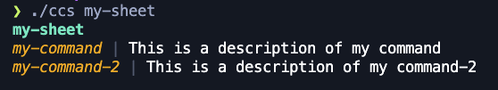

# cli-cheat-sheets (ccs)
Write your own cheat sheets in cli.

## Why

With so many tools in cli, custom scripts and functions, I forgot some commands or how to use some tool.

Have an entire list of cheat-sheets also does not help me to find what I need quickly and I spend a lot of time navigating the cheat-sheet instead of remember my favourite commands.

So, why not register all my favorite commands in a file simple to edit (yaml) and every time I want to remember something just run `cli-cheat-sheet ???` or `ccs ???` and it prints the command?

Well... here we are!


## Install

```
go install github.com/bhrott/ccs@latest
```


## Usage

```sh
# It will print a list of your cheat-sheets.
ccs my-sheet
```


```sh
# Will list all your cheat-sheets
ccs ls
```


## How to create cheat-sheets

By default, the cheat-sheets is a file in `~/.cli-cheat-sheets/cheat-sheets.yaml` with this structure:

```yaml
sheets:
  - id: cli-cheat-sheets
    items:
      - command: "ccs --ls"
        description: "List cheat sheets"
  - id: my-sheet
    items:
      - command: "my-command"
        description: "This is a description of my command"
      - command: "my-command-2"
        description: "This is a description of my command-2"
```

Explaining:

- `sheets:`: This is the root, dont change =P
    - `- id: my-cs`: the id of you sheet, you will use this to print in cli.
    - `  items:`: the list of your commands
        - `- command:`: the command, snippet, etc
        - `  description:`: any help text you want to add


Then you will use the command:

```sh
ccs my-sheet
```

It will output:

